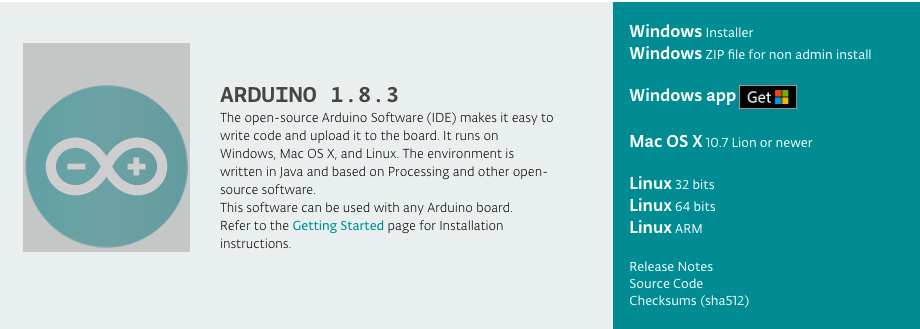
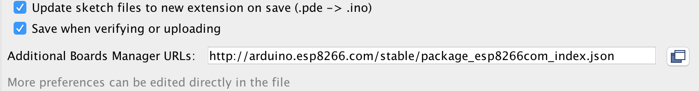
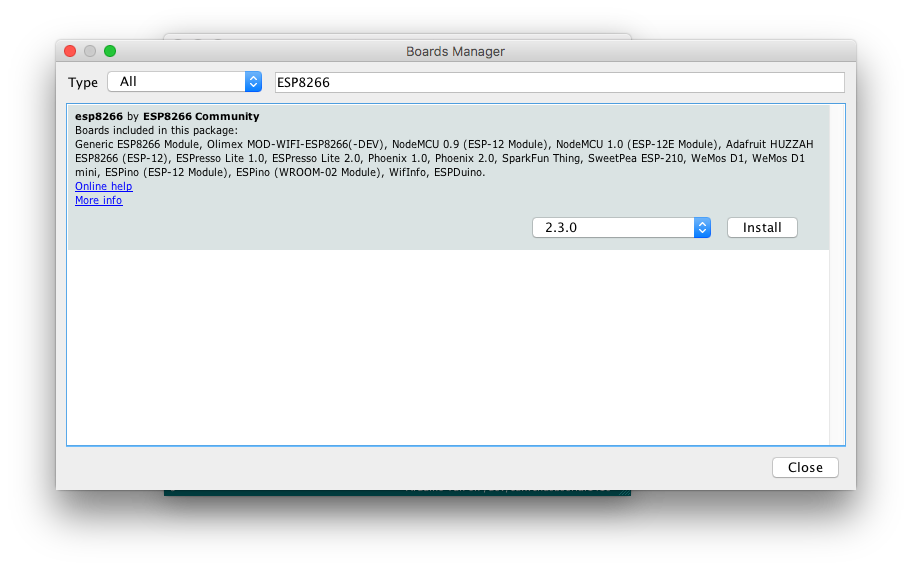
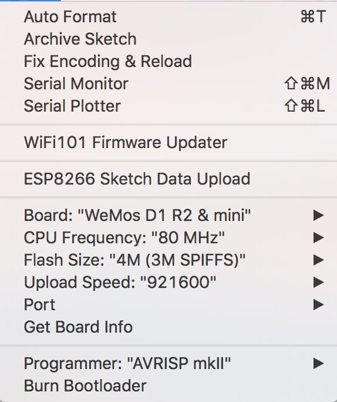
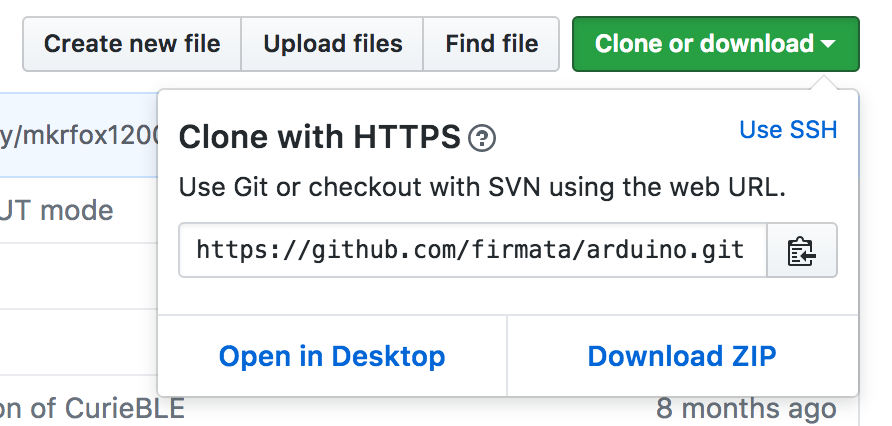
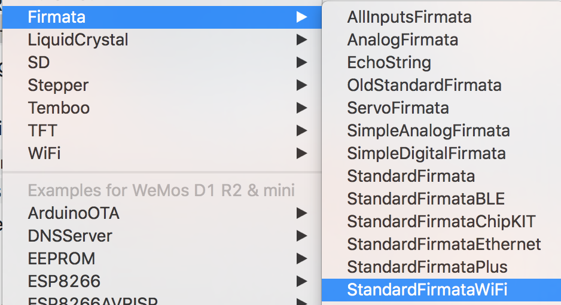
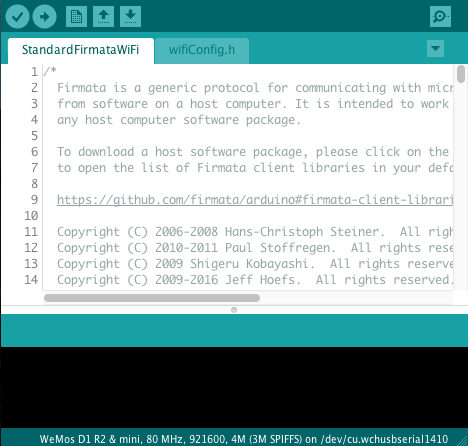
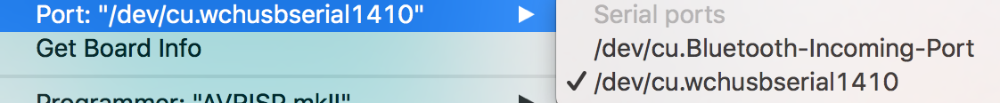
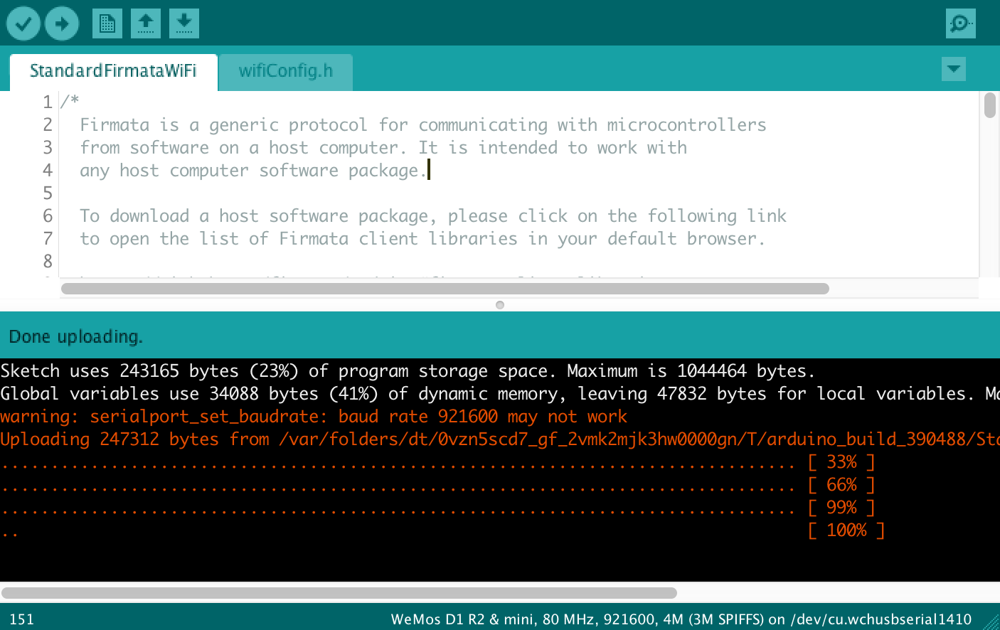
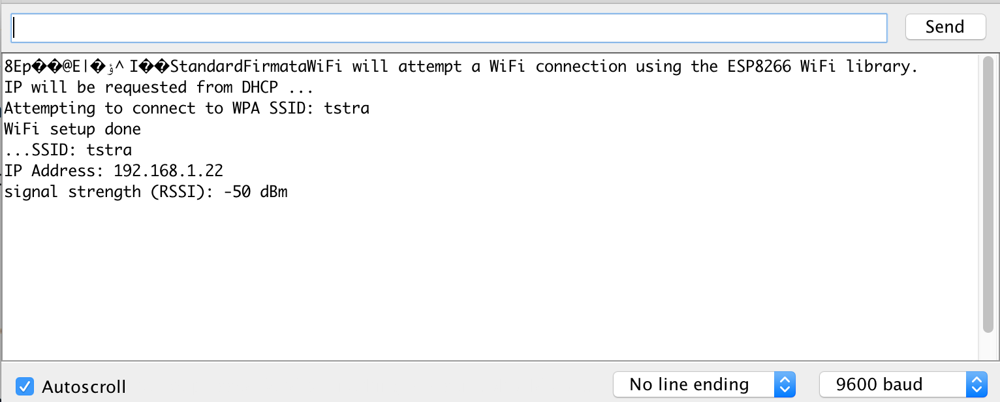

# Installing Firmata on WeMos D1 Mini
Below are instructions on how to install firmware on the WeMos D1 Mini that allows its use with Johnny Five and other Node.js projects.

## Initial Requirements

1. Get a high quality micro-USB to USB cable. This cannot be understated. A cheap cable will only provide power and an 
unreliable data connection. Get a nice USB cable that you know can transfer data.
1. Install the CH340G USB driver for your computer. In order to communicate over USB, you’ll need to install the proper USB to Serial driver: https://wiki.wemos.cc/downloads. This driver should be signed and ready to go. There are other unsigned versions available, but they are deprecated.
1. Download the [Arduino IDE](https://www.arduino.cc/en/Main/Software) Get the installable IDE, not the Web Editor. 

## Set up Arduino IDE

1. Open the Arduino IDE.
1. Open the _Preferences..._ menu.
1. In the _Additional Board Manager URLs_ field, enter the following URL: `ttp://arduino.esp8266.com/stable/package_esp8266com_index.json` 
1. Open the _Tools_ menu and select _Board > Board Manager..._
1. Search for "ESP8266" and install the *esp8266* package. 
1. In the _Tools > Board_ select "WeMos D1 R2 & Mini" 

## Download and Install the Firmata Firmware

1. Go to the [Firmata repository](https://github.com/firmata/arduino) and download the .zip file. 
1. Unzip the file into your _Documents/Arduino/libraries/_ folder. ("My Documents" on Windows).
1. Restart the Arduino IDE
1. Open the _File_ menu. Select _Examples > Firmata > StandardFirmataWifi_. 
1. This will open 2 files: StandardFirmataWifi and wifiConfig.h in your Arduino IDE. 

## Alter the Firmware to Work With a WeMos D1 Mini

1. StandardFirmataWifi - Line 85: Uncomment `#define SERIALL_DEBUG` by deleting the `//`. 
1. StandardFirmataWifi - Link 998: Add `analogWriteRange(255);` between `DEBUG_BIGIN(9600);` and `initTransport();`.
1. wifiConfig.h - Line 119: Replace "your_network_name" with the name of your wireless network (e.g. "WebWorkers Guest"). 
1. wifiConfig.h - Line 151: Replace "your_wpa_passphrase" with the password for your Wifi network.
1. Select _File > Save As..._ and save your firmware with a new name like StandardFirmataWifi-Nodebots.

## Install the Firmware

1. Plug the WeMos D1 Mini board into a USB port on your computer.
1. Open the _Tools > Port >_ and select the USB Serial entry (it will look different on Mac vs. PC). 
1. Click the "Verify" button on the Arduino IDE (the checkmark).
1. Then click the "Upload" button (the right-arrow) to upload the firmware to your WeMos. 
1. Open the _Tools_ menu and select _Serial Monitor_. Change the baud rate to _9600 baud_.
1. Press the 'reset' button on the WeMos (a very tiny button near the USB port). You should see the WeMos reset in the Serial Monitor window, and print out an IP address. .

### That's it!